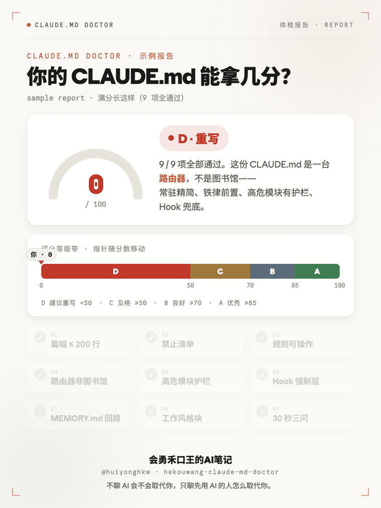

# hekouwang-claude-md-doctor

[简体中文](README.md) · **English**

[](https://github.com/huiyonghkw/hekouwang-claude-md-doctor/actions/workflows/ci.yml)
[](LICENSE)


> Made by **会勇禾口王的AI笔记** (Hekouwang's AI Notes) · `@huiyonghkw`

A health checker for `CLAUDE.md` — audits any project's `CLAUDE.md` against the
best practice of *"treat it as runtime config, not a project manual"*, and returns
a scorecard plus prioritized fixes.

<p align="center">
  
  <br><sub>↑ Say "check my CLAUDE.md" or run <code>python3 check.py</code> — instant score + fixes (free CLI)</sub>
</p>

The one rule it all comes down to: **CLAUDE.md is reloaded into context on every
session and costs tokens every time. Is this line worth paying for on every single session?**

<p align="center">
  
  <br><sub>↑ Branded visual report card (<b>paid add-on</b> sample) — the score arc fills and the grade morphs D→A. The free version outputs a text/JSON report.</sub>
</p>

## Why it exists

Most people write `CLAUDE.md` like a project manual: history, tech decisions,
marketing prose — easily over a thousand lines. The model then drowns in a bloated
context and loses the room it needs to actually understand your code. This tool
freezes 9 checkable best practices into a one-command audit anyone can run.

## The 9 checks

1. **Length ≤ 200 lines** — a router, not a library
2. **A "Do NOT introduce" list** — block well-meant but incompatible deps
3. **Actionable rules** — not vague "write clean code" platitudes
4. **Router, not library** — move big blocks to `docs/`, leave pointers
5. **Local CLAUDE.md for high-risk modules** — money / auth / migrations
6. **Hooks enforce the critical rules** — don't rely on the model's memory
7. **A MEMORY.md cross-session loop**
8. **A working-style block** — who you are / what you hate
9. **The 30-second test** — product? stack? where does new code go?

## Usage

### Inside Claude Code (recommended)
Just say **"check my CLAUDE.md"**. It runs the mechanical check, then does a
model-driven qualitative review, and returns a score with prioritized fixes —
and can apply the fixes for you.

### Command line (zero deps, just Python 3)
```bash
python3 check.py [project_dir]          # defaults to CWD, prints a colored report
python3 check.py [project_dir] --json   # machine-readable JSON (for CI)
```
Exit code: `1` if any FAIL, else `0` (usable as a CI gate).

### Docker (no Python needed)
```bash
# Pull the prebuilt image (auto-published to GHCR on each tag via GitHub Actions)
docker run --rm -v "$PWD:/work" ghcr.io/huiyonghkw/hekouwang-claude-md-doctor

# Or build locally
docker build -t claude-md-doctor .
docker run --rm -v "$PWD:/work" claude-md-doctor            # check current project
docker run --rm -v "$PWD:/work" claude-md-doctor /work --json
```

### Gate your PRs (GitHub Actions)
```yaml
- uses: actions/setup-python@v5
  with: { python-version: "3.x" }
- name: CLAUDE.md health check (fail the PR if non-compliant)
  run: |
    curl -sO https://raw.githubusercontent.com/huiyonghkw/hekouwang-claude-md-doctor/main/check.py
    python3 check.py .
```
This repo's own CI lives in [`.github/workflows/ci.yml`](.github/workflows/ci.yml) (syntax + good/bad fixtures + JSON validity).

## Free / Paid (Freemium)

- **Free (open-source core)**: the `check.py` CLI — text / JSON report, score,
  exit code. Run it locally or in Docker, wire it into CI. Free forever.
- **Paid (add-on service)**: the **branded visual report card** (score arc +
  grade band + 9-check breakdown, great for sharing / PRs). It depends on a
  private visual system (brand fonts & layout) and is **not shipped in this repo**.
  Want the image version? Contact **@huiyonghkw**.

> In one line: **running the check is free; getting the pretty report image, talk to me.**

## Design

- **Mechanical layer (`check.py`)**: deterministic, zero-dependency, portable —
  runs heuristic checks and scores them.
- **Qualitative layer (`SKILL.md`)**: the model reads the actual file to cover the
  checker's blind spots (library vs router, whether rules are truly actionable),
  then produces the final report and fix plan.
- **Safety**: never reads `.env` / `*.key` / `*.pem` secrets; the audit is
  read-only and any edits require confirmation.

## Grade bands

A (excellent) ≥85 · B (good) ≥70 · C (pass) ≥50 · D (rewrite) <50

## License

The code in this repo is open-sourced under the **MIT License** — free to use,
modify, distribute, and use commercially; just keep the copyright and license
notice. See [LICENSE](LICENSE).

> Scope: MIT covers the repo's code (`check.py` / `SKILL.md`, etc.). The brand
> name "会勇禾口王的AI笔记" and the **paid visual report card** (which relies on
> unreleased brand fonts & layout) are an add-on service, outside the open-source
> scope — but that does not affect your free, unrestricted use of the CLI checker.

## Contributing

Issues / PRs welcome: new checks, fewer false positives, heuristics for more
languages/frameworks. Keeping **zero runtime dependencies** (Python 3 stdlib only)
is a hard constraint.

---

<sub>—— 会勇禾口王的AI笔记 · @huiyonghkw · AI in practice: coding × content × automation</sub>
